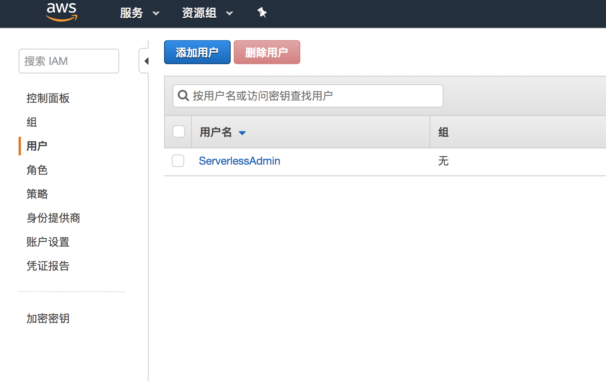
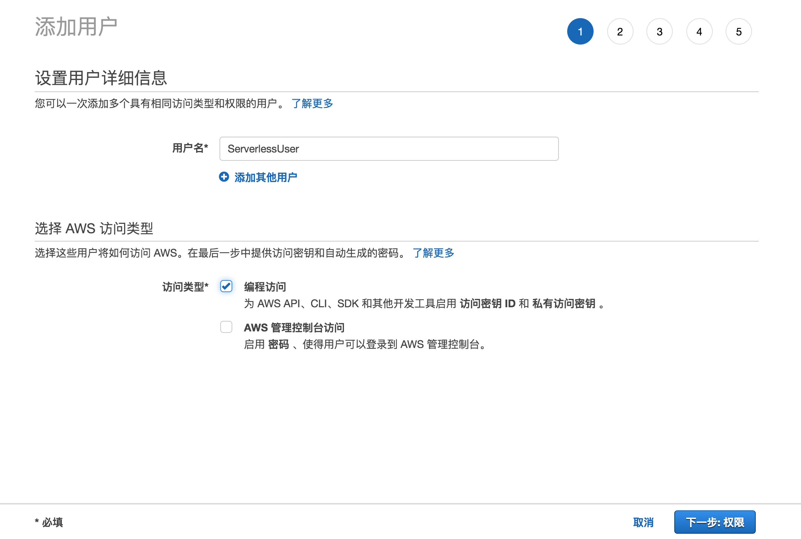
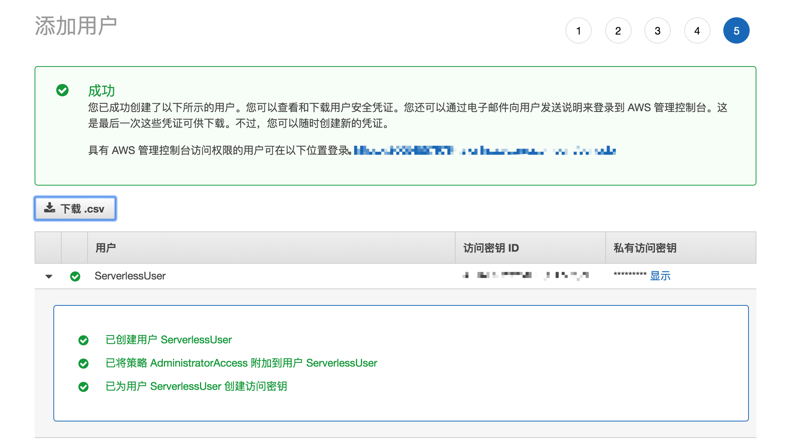
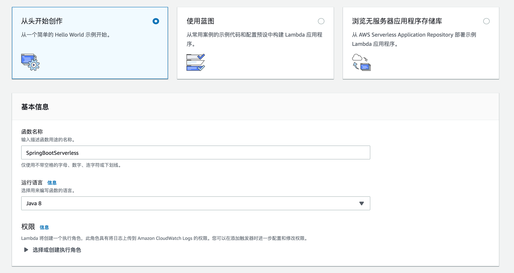
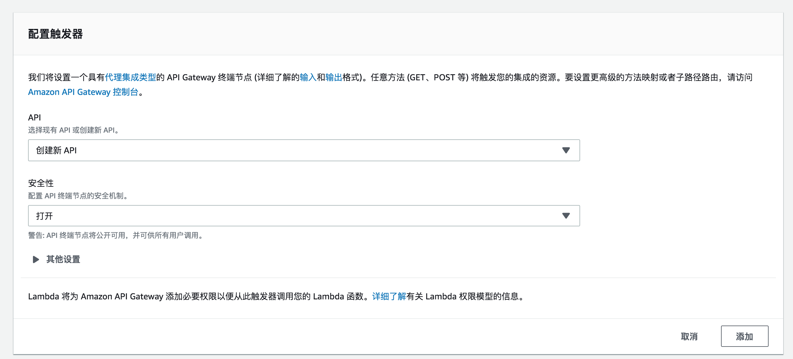
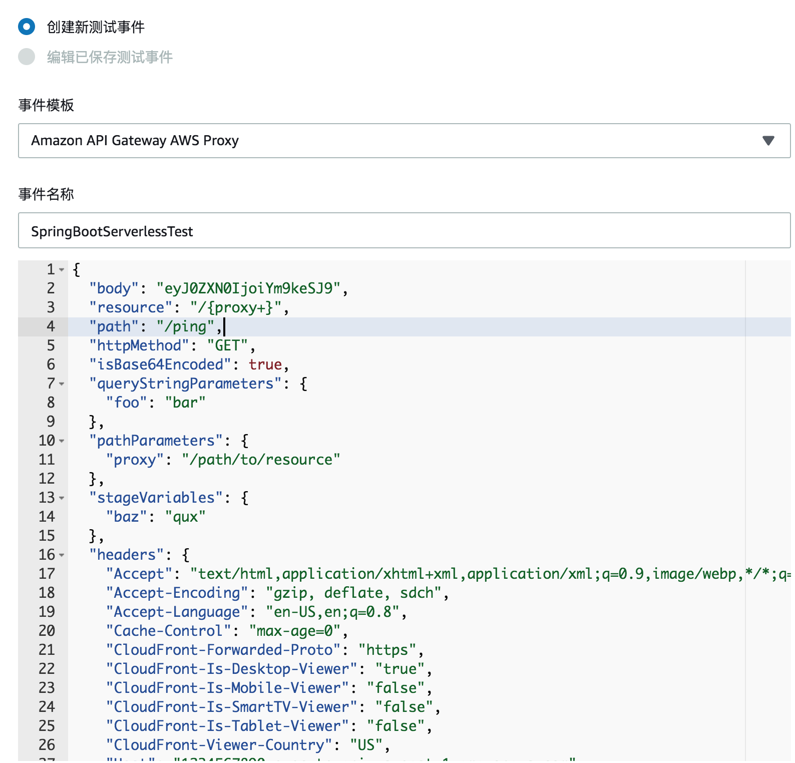
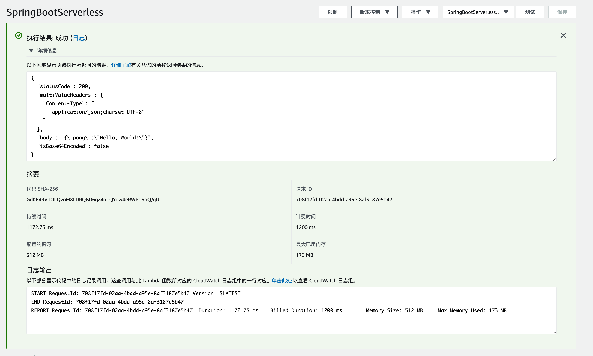

# AWS Lambda 部署 SpringBoot 应用

## 快速开始

```bash
git clone https://github.com/helloworlde/serverless-spring-boot.git
cd serverless-spring-boot
./gradlew clean build serverless-spring-boot

# Local
sam local start-api --template sam.yaml

curl -s http://127.0.0.1:3000/ping

# Deploy
sls deploy
```


## 配置 AWS CLI 和  Severless

AWS CLI 和 Serverless 都可以用于部署 Serverless 应用

### 获取密钥

1. 登录 AWS， 在服务中搜索并选择 IAM，之后选择用户，添加用户



2. 输入用户名，选择编程访问



3. 选择权限-直接附加现有策略，搜索`AdministratorAccess`并选中(有最高权限)


4. 选择下一步直到完成，然后保存好密钥(只会出现这一次，否则就只能重新创建)




### 安装配置 AWS CLI

#### 安装

参考 [AWS 命令行界面](https://aws.amazon.com/cn/cli/) 安装

- Win 下载 [https://s3.amazonaws.com/aws-cli/AWSCLI64.msi](https://s3.amazonaws.com/aws-cli/AWSCLI64.msi) 安装
- Mac/Linux 执行 `pip install awscli`

#### 配置 AWS CLI

```bash
aws configure
```
然后输入刚才的密钥的 Key 和 Secret，Region 可以选择常用的 region，如`us-east-1`


### 安装配置 Severless

#### 安装
```bash
npm install -g serverless
或 
yarn global add serverless
```
 
#### 配置

```bash
serverless config credentials --provider aws --key YOUR_KEY --secret YOUR_SECRET
``` 

### 安装配置 AWS SAM Local

aws-sam-local 是用于本地调试 Serverless 应用的工具

#### 安装 

```bash
npm install -g aws-sam-local
或 
yarn global add aws-sam-local
```


## 创建 Spring Boot 应用 

### 通过 Maven 插件快速生成

```bash
mvn archetype:generate \
        -DgroupId=io.github.helloworlde \
        -DartifactId=serverless-spring-boot \
        -Dversion=1.0-SNAPSHOT \
        -DarchetypeGroupId=com.amazonaws.serverless.archetypes \
        -DarchetypeArtifactId=aws-serverless-springboot2-archetype \
        -DarchetypeVersion=1.3.1
```

- 项目文件

```bash
.
├── README.md
├── build.gradle
├── pom.xml
├── sam.yaml
└── src
    ├── assembly
    │   └── bin.xml
    ├── main
    │   ├── java
    │   │   └── io
    │   │       └── github
    │   │           └── helloworlde
    │   │               ├── Application.java
    │   │               ├── StreamLambdaHandler.java
    │   │               └── controller
    │   │                   └── PingController.java
    │   └── resources
    │       └── application.properties
    └── test
        └── java
            └── io
                └── github
                    └── helloworlde
                        └── StreamLambdaHandlerTest.java
```

### 手动创建

1. 创建 SpringBoot 应用
2. 修改 build.gradle

```groovy
buildscript {
    ext {
        springBootVersion = '2.1.1.RELEASE'
    }
    repositories {
        mavenCentral()
    }
    dependencies {
        classpath("org.springframework.boot:spring-boot-gradle-plugin:${springBootVersion}")
    }
}


apply plugin: 'java'
apply plugin: 'org.springframework.boot'
apply plugin: 'io.spring.dependency-management'


archivesBaseName = 'serverless-spring-boot'
group = 'io.github.helloworlde'
version = '0.0.1-SNAPSHOT'
sourceCompatibility = 1.8

repositories {
    jcenter()
    mavenLocal()
    mavenCentral()
}

dependencies {
    compile(
            'org.springframework.boot:spring-boot-starter-web',
            'com.amazonaws.serverless:aws-serverless-java-container-spring:[1.0,)',
            'io.symphonia:lambda-logging:1.0.1'
    )

    testCompile("junit:junit:4.12")
}

task buildZip(type: Zip) {
    from compileJava
    from processResources
    into('lib') {
        from(configurations.compileClasspath) {
            exclude 'tomcat-embed-*'
        }
    }
}

build.dependsOn buildZip
```

- 添加 PingController.java

```java
package io.github.helloworlde.controller;


import org.springframework.web.bind.annotation.*;
import org.springframework.web.servlet.config.annotation.EnableWebMvc;

import java.util.HashMap;
import java.util.Map;


@RestController
@EnableWebMvc
public class PingController {
    @RequestMapping(path = "/ping", method = RequestMethod.GET)
    public Map<String, String> ping() {
        Map<String, String> pong = new HashMap<>();
        pong.put("pong", "Hello, World!");
        return pong;
    }
}
```

- 添加 StreamLamdbaHandler.java

StreamLamdbaHandler 相当于一个代理层，将访问 Lambda 的流量转发给 SpringBoot应用；handleRequest方法每次请求都会被调用

```java
package io.github.helloworlde;


import com.amazonaws.serverless.exceptions.ContainerInitializationException;
import com.amazonaws.serverless.proxy.model.AwsProxyRequest;
import com.amazonaws.serverless.proxy.model.AwsProxyResponse;
import com.amazonaws.serverless.proxy.spring.SpringBootLambdaContainerHandler;
import com.amazonaws.services.lambda.runtime.Context;
import com.amazonaws.services.lambda.runtime.RequestStreamHandler;

import java.io.IOException;
import java.io.InputStream;
import java.io.OutputStream;


public class StreamLambdaHandler implements RequestStreamHandler {
    private static SpringBootLambdaContainerHandler<AwsProxyRequest, AwsProxyResponse> handler;
    static {
        try {
            handler = SpringBootLambdaContainerHandler.getAwsProxyHandler(Application.class);
        } catch (ContainerInitializationException e) {
            // if we fail here. We re-throw the exception to force another cold start
            e.printStackTrace();
            throw new RuntimeException("Could not initialize Spring Boot application", e);
        }
    }

    @Override
    public void handleRequest(InputStream inputStream, OutputStream outputStream, Context context)
            throws IOException {
        handler.proxyStream(inputStream, outputStream, context);
    }
}
```

- 添加 sam.yaml

sam 用于本地测试Serverless 应用，依赖于 Python 和 Docker

需要注意的是，`Resources.ServerlessSpringBootFunction.Properties.CodeUri`这个路径需要根据使用 Gradle 或 Maven 进行修改

```yaml
AWSTemplateFormatVersion: '2010-09-09'
Transform: AWS::Serverless-2016-10-31
Description: AWS Serverless Spring Boot 2 API - io.github.helloworlde::serverless-spring-boot
Globals:
  Api:
    EndpointConfiguration: REGIONAL

Resources:
  ServerlessSpringBootFunction:
    Type: AWS::Serverless::Function
    Properties:
      Handler: io.github.helloworlde.StreamLambdaHandler::handleRequest
      Runtime: java8
      CodeUri: build/distributions/serverless-spring-boot.zip
      MemorySize: 512
      Policies: AWSLambdaBasicExecutionRole
      Timeout: 30
      Events:
        GetResource:
          Type: Api
          Properties:
            Path: /{proxy+}
            Method: any

Outputs:
  ServerlessSpringBootApi:
    Description: URL for application
    Value: !Sub 'https://${ServerlessRestApi}.execute-api.${AWS::Region}.amazonaws.com/Prod/ping'
    Export:
      Name: ServerlessSpringBootApi
```

## 测试 

### 编译生成 zip

```bash
gradle clean build
```

### 测试应用接口

1. 启动应用 
2. 访问 `http://localhost:8080/ping`，应当返回结果：

```json
{
  "pong": "Hello, World!"
}
```

### 使用 SAM 测试

```java
sam local start-api --template sam.yaml
```

```bash
curl -s http://127.0.0.1:3000/ping
```
将会看到输出结果：

```json
{"pong":"Hello, World!"}%
```


## 部署 

### Serverless 部署 

- 在项目根路径中添加 serverless.yml 配置

```yaml
service: spring-boot-serverless

provider:
  name: aws
  runtime: java8

package:
  artifact: build/distributions/serverless-spring-boot.zip

functions:
  springBootServerless:
    handler: io.github.helloworlde.StreamLambdaHandler::handleRequest
    events:
      - http:
          path: /ping
          method: get
    timeout: 30
```

- 发布 

```bash
sls deploy
```

日志：

```bash
sls deploy                             
Serverless: Packaging service...
Serverless: Uploading CloudFormation file to S3...
Serverless: Uploading artifacts...
Serverless: Uploading service serverless-spring-boot.zip file to S3 (12.73 MB)...
Serverless: Validating template...
Serverless: Updating Stack...
Serverless: Checking Stack update progress...
..............
Serverless: Stack update finished...
Service Information
service: spring-boot-serverless
stage: dev
region: us-east-1
stack: spring-boot-serverless-dev
resources: 10
api keys:
  None
endpoints:
  GET - https://cmu9z3fmd1.execute-api.us-east-1.amazonaws.com/dev/ping
functions:
  springBootServerless: spring-boot-serverless-dev-springBootServerless
layers:
  None

```

- 访问 

访问 [https://cmu9z3fmd1.execute-api.us-east-1.amazonaws.com/dev/ping](https://cmu9z3fmd1.execute-api.us-east-1.amazonaws.com/dev/ping)

```json
{
  "pong": "Hello, World!"
}
```

### 使用 AWS CLI 发布 

#### 上传到 S3

上传到 S3 时需要有一个 Bucket 存在，可以在 AWS 服务-S3 中创建

- 创建 Bucket

```bash
aws s3 mb s3://spring-boot-serverless --region us-east-1
```

- 上传应用 

```bash
aws cloudformation package --template-file sam.yaml --output-template-file output-sam.yaml --s3-bucket spring-boot-serverless 
```

这个命令执行之后会在项目根目录下生成一个 `output-sam.yaml`

输出

```bash
Uploading to e793ef8960075db672fce0a8ac65f03b  13353411 / 13353411.0  (100.00%)
Successfully packaged artifacts and wrote output template to file output-sam.yaml.
Execute the following command to deploy the packaged template
aws cloudformation deploy --template-file /Users/HelloWood/Dev/Projects/Serverless/serverless-spring-boot/output-sam.yaml --stack-name spring-boot-serverless

```

#### 部署

```bash
aws cloudformation deploy --template-file /Users/HelloWood/Dev/Projects/Serverless/serverless-spring-boot/output-sam.yaml --stack-name spring-boot-serverless-demo --capabilities CAPABILITY_IAM
```

需要注意的是 `--capabilities CAPABILITY_IAM`会创建一个新的角色，会使用 `AWSLambdaBasicExecutionRole`，该策略仅允许该角色访问 Lambda 相关的资源，也可以使用 `CAPABILITY_AUTO_EXPAND`或`CAPABILITY_NAMED_IAM`使用已有的角色；创建后的角色可以在 AWS IAM 的角色下面管理

#### 测试

- 获取应用信息

```bash
aws cloudformation describe-stacks --stack-name spring-boot-serverless-demo
```

```json
{
    "Stacks": [
        {
            "StackId": "arn:aws:cloudformation:us-east-1:266545579784:stack/spring-boot-serverless-demo/1074b6a0-6f97-11e9-835b-0e348661d726",
            "StackName": "spring-boot-serverless-demo",
            "ChangeSetId": "arn:aws:cloudformation:us-east-1:266545579784:changeSet/awscli-cloudformation-package-deploy-1557103210/fe06fc3b-a353-4d42-814a-4e4f736a2026",
            "Description": "AWS Serverless Spring Boot 2 API - io.github.helloworlde::serverless-spring-boot",
            "CreationTime": "2019-05-06T00:37:01.857Z",
            "LastUpdatedTime": "2019-05-06T00:40:17.502Z",
            "RollbackConfiguration": {},
            "StackStatus": "CREATE_COMPLETE",
            "DisableRollback": false,
            "NotificationARNs": [],
            "Capabilities": [
                "CAPABILITY_IAM"
            ],
            "Outputs": [
                {
                    "OutputKey": "ServerlessSpringBootApi",
                    "OutputValue": "https://gf2c9fhhql.execute-api.us-east-1.amazonaws.com/Prod/ping",
                    "Description": "URL for application",
                    "ExportName": "ServerlessSpringBootApi"
                }
            ],
            "Tags": [],
            "EnableTerminationProtection": false,
            "DriftInformation": {
                "StackDriftStatus": "NOT_CHECKED"
            }
        }
    ]
}
```

- 访问 OutputValue 的 URL 

```bash
curl https://gf2c9fhhql.execute-api.us-east-1.amazonaws.com/Prod/ping
```

```bash
{"pong":"Hello, World!"}%
```

### 页面手动部署

#### 创建函数

- 选择服务 - Lambda - 函数 - 创建函数 - 从头开始创作

权限可以选择现有的角色或者新建角色


- 添加触发器，选择 API-Gateway 作为触发器，然后保存



- 点击Layers 的 Spring 应用，上传 zip，在 `build/`或`target/`下；运行语言选择 Java8，处理程序为`io.github.helloworlde.StreamLambdaHandler::handleRequest`，点击保存


#### 测试 

- 选择配置测试事件 - 创建新测试事件 - 选择 `AWS API Gateway AWS Proxy`，修改相关的path和httpMethod





- Gateway 的 URL 可以点击 API Gateway查看

----------

### 项目地址 

 [https://github.com/helloworlde/serverless-spring-boot](https://github.com/helloworlde/serverless-spring-boot)
 
### 参考文章 

- [A complete guide for running Spring Boot MVC in the cloud using AWS Lambda](https://skryvets.com/blog/2018/06/02/spring-boot-aws-lambda-guide/)
- [使用 Java 构建 Lambda 函数](https://docs.aws.amazon.com/zh_cn/lambda/latest/dg/java-programming-model.html)
- [Installing the AWS SAM CLI on macOS](https://docs.aws.amazon.com/zh_cn/serverless-application-model/latest/developerguide/serverless-sam-cli-install-mac.html)
- [Installing the AWS SAM CLI](https://docs.aws.amazon.com/zh_cn/serverless-application-model/latest/developerguide/serverless-sam-cli-install.html)
- [Key Tasks for the AWS Toolkit for JetBrains](https://docs.aws.amazon.com/zh_cn/toolkit-for-jetbrains/latest/userguide/key-tasks.html#key-tasks-install)
- [如何看待 AWS Lambda](https://www.zhihu.com/question/29490143)
- [aws-serverless-java-container](https://github.com/awslabs/aws-serverless-java-container)
- [Quick start Spring Boot](https://github.com/awslabs/aws-serverless-java-container)